# Using KeePass as a 2-step sign-in method with Google accounts

This post is about using KeePass with Google account for the 2-step verification process.

General considerations about using KeePass as a storage for TOTP keys and generator of one-time-password, can be found <strong> ==> [here]() <== </strong>:

The following steps assume the 2-step-verification has been already activated. If not active, some more steps are required. But the fundamental ones are the same.

With a Google account, login to <https://myaccount.google.com/> and select Security:

<myimage>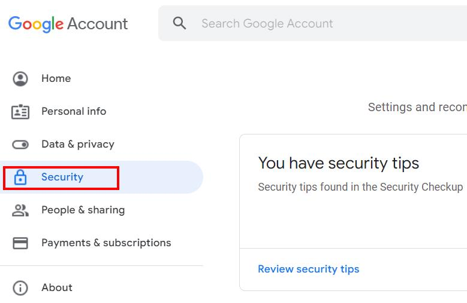</myimage>

Select 2-Step verification details:

<myimage>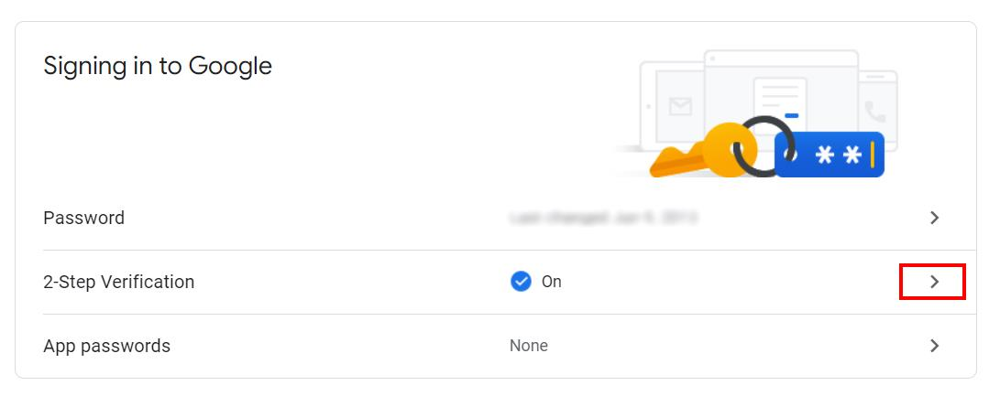</myimage>

If an authenticator is already registered, it is impossible to generate a new key. The old one must be removed and a new one created. Select the details of authenticator app:

<myimage>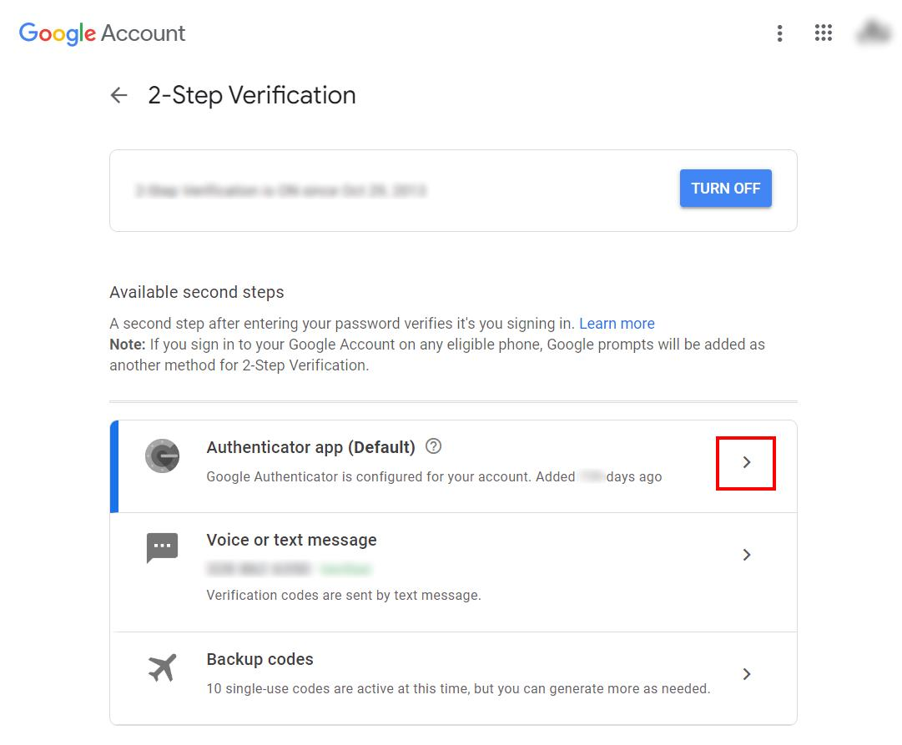</myimage> 

Remove the current authenticator app. **Important:** before doing that, be sure to have activate another authentication method like "phone SMS" and "backup codes".

<myimage>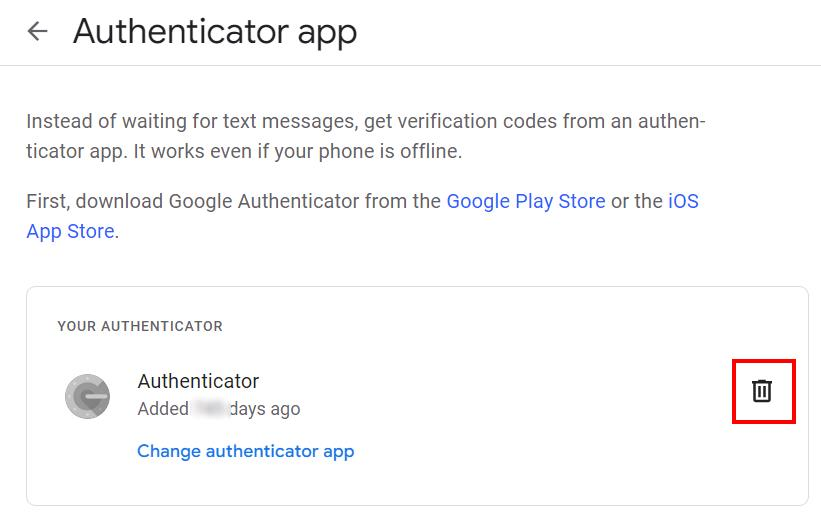</myimage> 

Add a new authenticator app:

<myimage>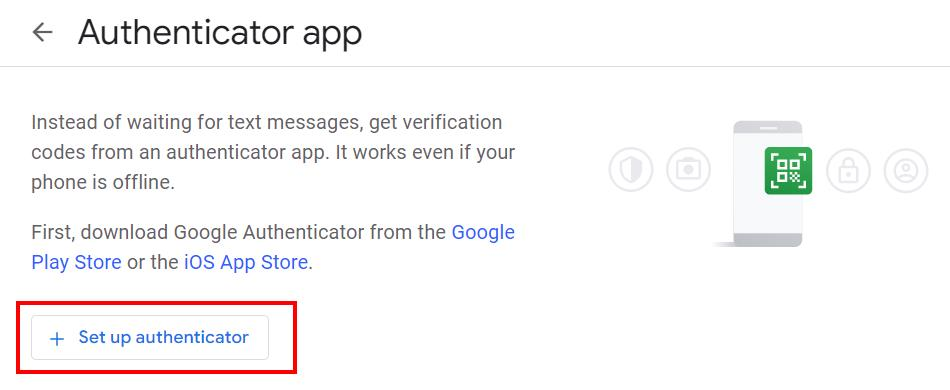</myimage> 

Google generates a new random TOTP key and embeds it into a datamatrix. This is very useful for auto-registering the Authenticator but, for now, press "Can't scan it?"

<myimage>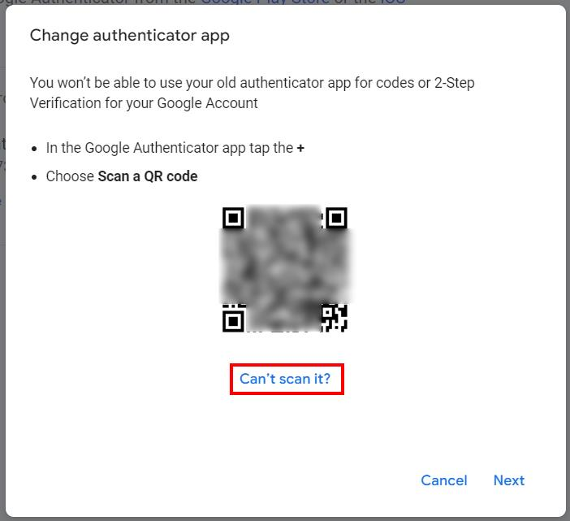</myimage> 

Now the secret key appears as plain text:

<myimage>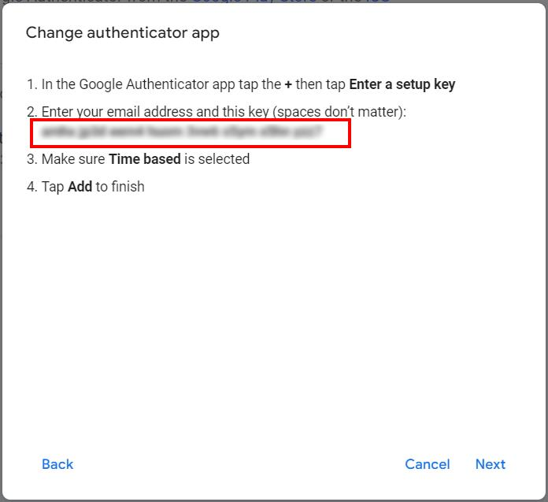</myimage> 

Copy and paste the value inside KeePass:

<myimage>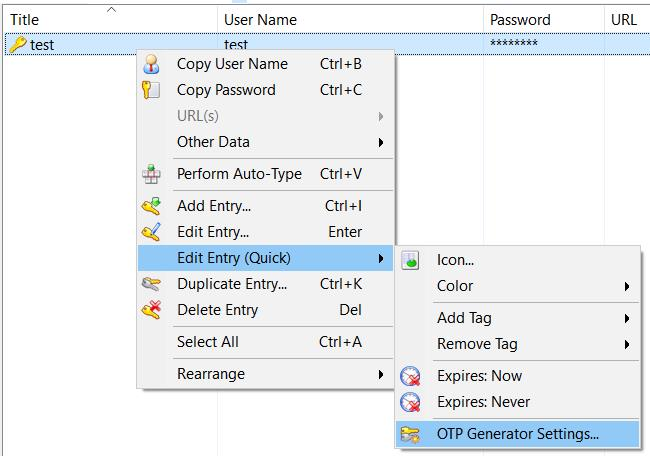</myimage>  

<myimage>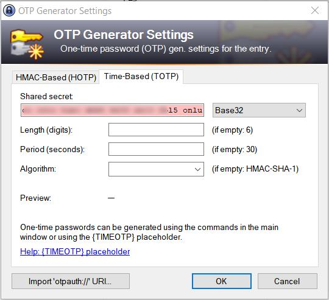</myimage> 

Remove the white spaces and leave the other values empty (default values). If everything is correct, KeePass immediately starts generating OTP values. Press OK

<myimage>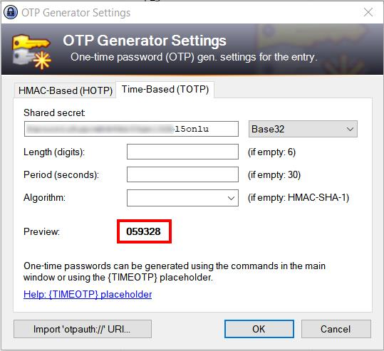</myimage>  

Now, press "back" in the browser for coming back to the datamatrix. From the mobile Authenticator app, scan the datamatrix. Now the mobile Authenticator app and KeePass are generating the same one-time-password code, as expected.

Press "next" in the browser and enter the generated code:

<myimage>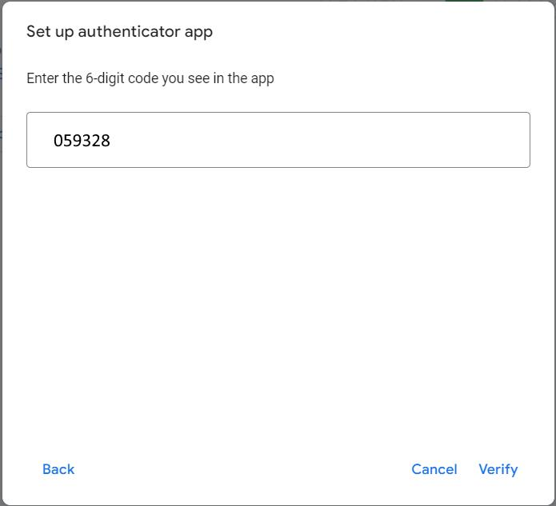</myimage> 

Now the Authenticator app and KeePass are ready to be used.

<myimage>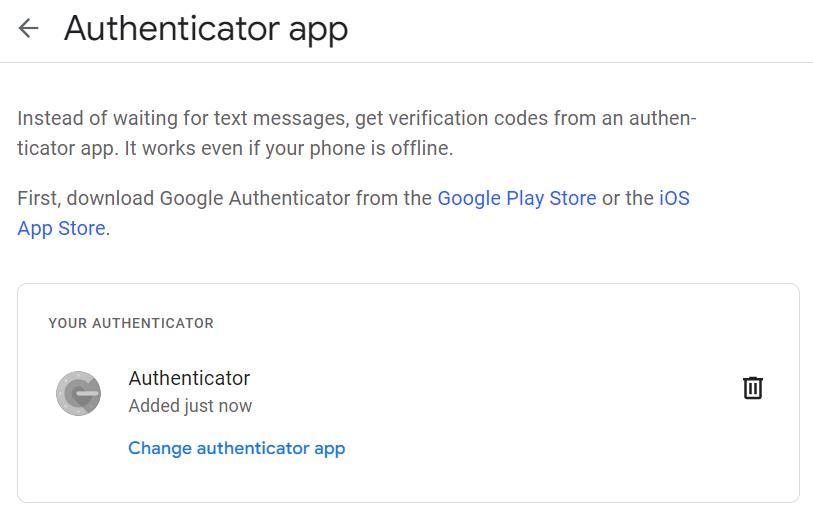</myimage>  

For obtaining an OTP code from KeePass, right click the entry -> other data -> copy time-based otp. Paste it where required.

<myimage>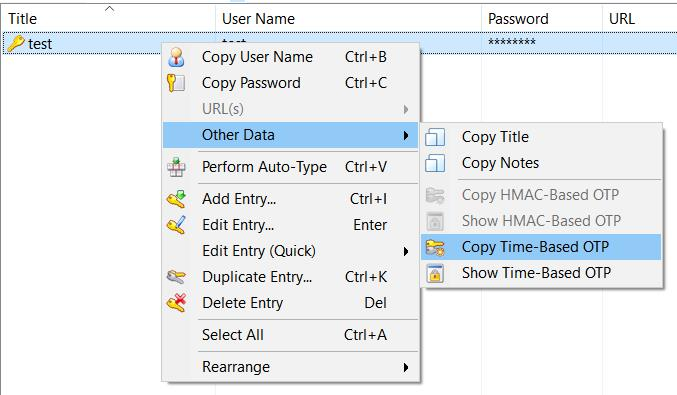</myimage> 

 
 