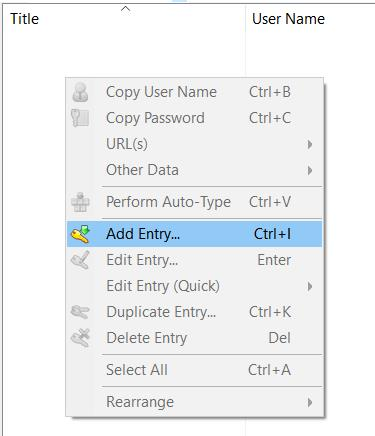
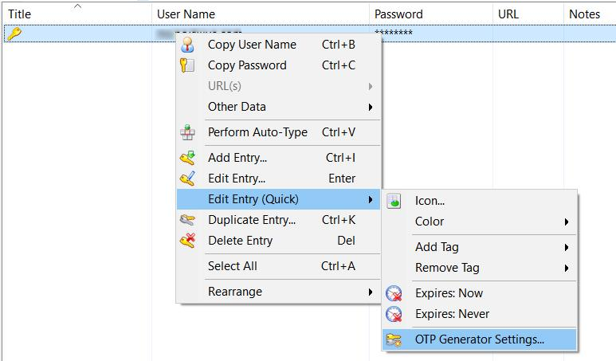
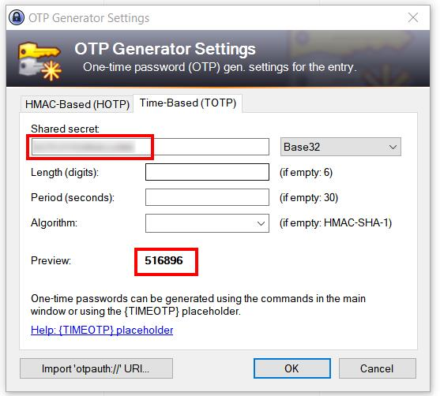
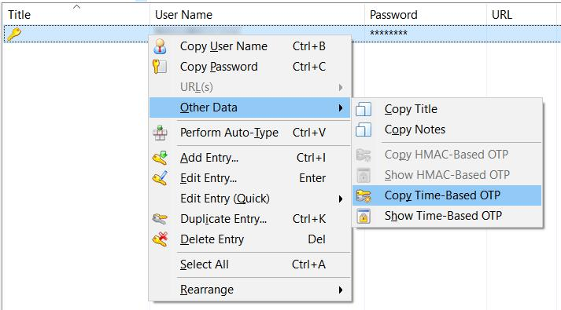
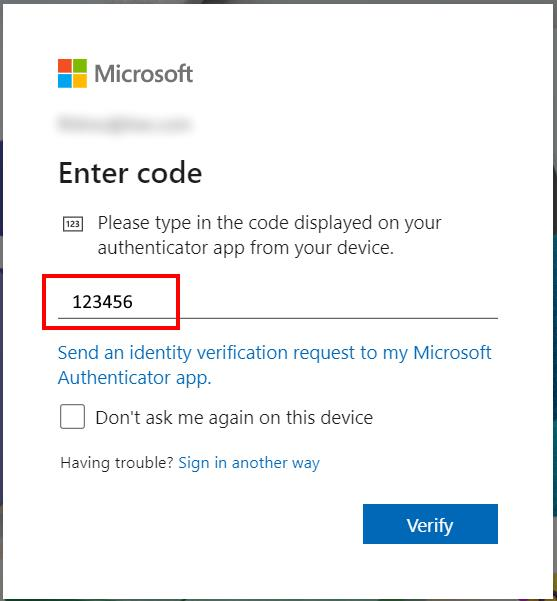
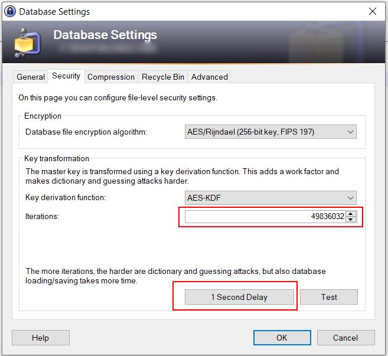

# Using KeePass as TOTP keys storage and OTP generator with Microsoft and Google accounts


In this page:
- TOTP, OTP and authenticator introduction
- General use of KeePass as TOTP key storage and OTP generator
- Cases: Microsoft and Google accounts

 

People normally prefer using classic authenticator applications, running on mobile phone, like Microsoft Authenticator and Google Authenticator. They are easy to be setup: scanning a data-matrix is enough to import required data and to be ready to generate one-time-passwords, OTP. But sometimes could be useful to have a second OTP generator, alongside the classic authenticator app on mobile. KeePass can help. It was born as a secure password storage but can also securely store other information. Starting from the version 2.51, it is even more easier storing TOTP keys and generating one-time-passwords.

Authenticator are based on TOTP protocol. Many (all?) account providers use it, like Microsoft and Google, in the 2-steps/multi-factor-authentication services. TOTP works by sharing a secret key between the authentication provider and the OTP generator (the authenticator app). Secret key and other information are normally imported by scanning a datamatrix, generated by the authentication provider. The datamatrix holds much information but the really relevant one is the secret key.

Example of data stored into the datamatrix: 
```
otpauth://totp/Google:accountname@gmail.com?secret=xxxxxxxx&issuer=Google
otpauth://totp/Microsoft:accountname@live.com?secret=xxxxxxxx&issuer=Microsoft
```


The whole process can be summarized as:
1. Authentication provider generates a TOTP secrect key and display it as a datamatrix
2. The user scans the datamatrix using the authenticator app and the app imports secret key alongside other side-data.
3. The app is ready to be used.
4. App continuously generate OTP codes, based on TOTP secret key. They are refreshed every 30 seconds.
5. User, when required, can use the generated codes during the authentication process.

Note: Microsoft and Google authenticator apps have automatic features when dealing with their native accounts. So, some steps are more integrated and automatic as described here.

As previously anticipated, KeePass can be used as an authenticator. It manages both the secure storage of TOTP secret keys and the generation of OTP one-time-password codes. Note: because KeePass is mainly a password manager, it also stores regular passwords. Storing all security related data in the same place is dangerous. TOTP keys should not be stored alongside account passwords which relate to. So, from a security perspective it not a good choice to store password and TOTP keys into the same storage. You should use at least two different KeePass files with different master-passwords.

Using KeePass as an authenticator requires the following steps.

Create a new entry or edit an existing one.

<myimage></myimage>

To import a TOTP secret key, right click the entry and select Edit Entry (Quick) --> OTP Generator Settings.

<myimage></myimage>

Enter the TOTP secret key generated by the authentication provider (e.g. Microsoft, Google, etc.). If available, use copy-and-paste to avoid error. Remember to remove spaces from value entered into KeePass. Leave the other fields empty. The default values (6 digits, 30 seconds) are fine for many/all? providers.

After entering the key, KeePass immediately starts generating OTP codes. It is automatically renewed every 30 seconds (more precisely, on hh:mm:00 and on hh:mm:30).

<myimage></myimage>

To generate a one-time-password, required during the authentication process, right click on the entity and select Other Data --> Copy Time-Based OTP.

<myimage></myimage>

Copy and paste into the authentication form, where required.

<myimage></myimage>

Suggestion: after storing TOTP secret keys, try if KeePass works as expected. Login into your account using a browser in incognito mode for not interfering with exiting logged-in sessions.

Here is some account pages:
 - Google accounts: https://myaccount.google.com/
 - Microsoft work accounts: https://myaccount.microsoft.com/
 - Microsoft consumer accounts: https://account.microsoft.com/

Generally, there are restriction on the number of secret keys allowed per account. Google limits to only one. Microsoft consumer accounts allow 2 keys, one linked to the Microsoft Authenticator and one to a generic authenticator app. So, storing the same key on the authenticator app and on KeePass could be tricky.


The following 3 articles highlight the required and particular steps for using KeePass with Microsoft and Google accounts:

**Microsoft consumer accounts (outlook, live, etc.)**  
https://www.fhtino.it/blog/using-keepass-as-an-mfa-2-step-sign-in-method-with-microsoft-consumer-accounts

**Microsoft work accounts**  
https://www.fhtino.it/blog/using-keepass-as-mfa-sign-in-method-with-microsoft-work-accounts

**Google accounts**  
https://www.fhtino.it/blog/using-keepass-as-a-2-step-sign-in-method-with-google-accounts

Last but not least: remember to periodically backup the KeePass database file (the .kdbx file), use a strong master-password and high values for “iterations”.

<myimage></myimage>

