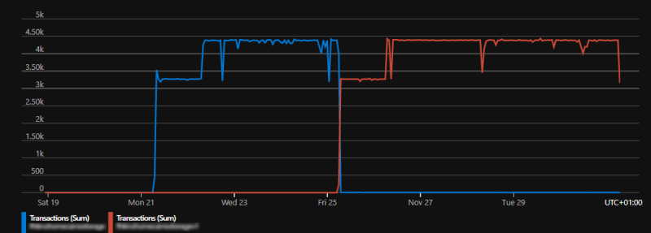
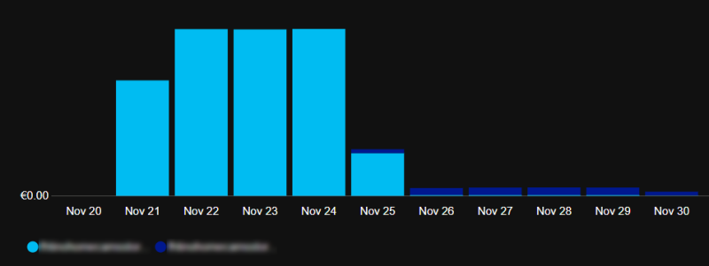

# DRAFT : Azure Storage Accounts pricing tips

Carefully consider the different prices of storage account V1 and V2. If you don't need V2, consider using V1. In particular when you have many transactions. Example below: same application, same number of transactions per day, storage changed from V2 to V1.

<myimage></myimage>

<myimage></myimage>

